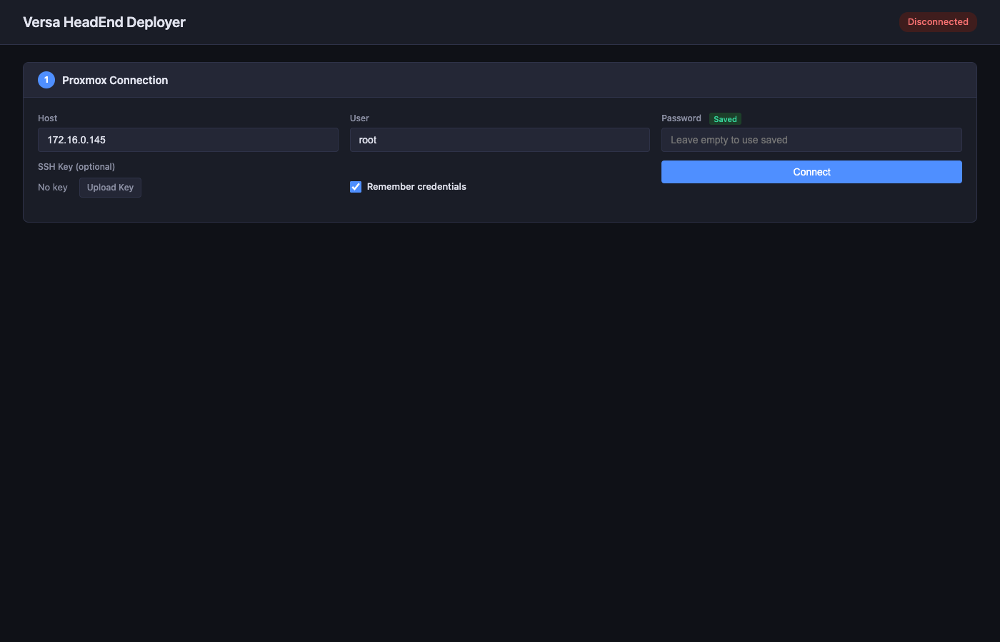
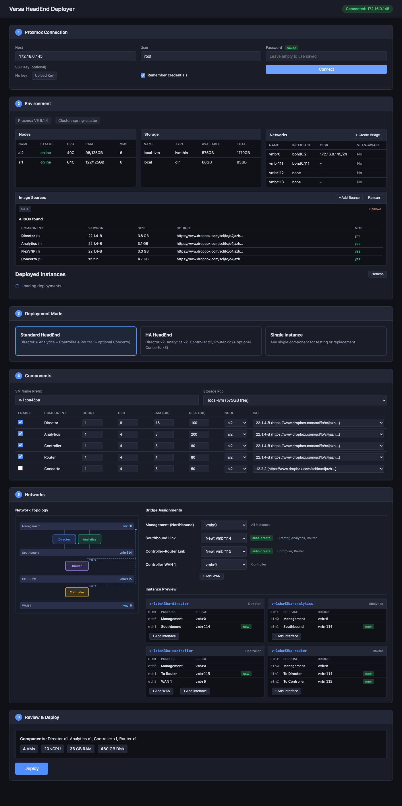

# Versa HeadEnd Proxmox Deployer

A single-binary tool that automates Versa Networks HeadEnd deployment on Proxmox VE. Runs a local web UI, connects to Proxmox via SSH, auto-discovers resources, and deploys VMs with proper networking.

## Features

- **Web UI** - Browser-based interface at `http://localhost:1050`
- **Auto-discovery** - Detects Proxmox nodes, storage pools, network bridges, and existing deployments
- **Serial Console** - Open a live terminal to any running VM directly from the browser (xterm.js)
- **Multi-source ISO scanning** - Dropbox, HTTP, SFTP, and local folder sources
- **Standard and HA modes** - Deploy single instances or full HA with 2x redundancy
- **Network topology diagram** - Visual SVG diagram of VM interconnections
- **Interface reordering** - Reorder all network interfaces per instance to control eth assignment
- **Deployment management** - List, stop, and delete previously deployed VMs
- **Auto rollback** - Cleans up on deployment failure
- **VM tagging** - All VMs tagged for identification and grouped by deployment
- **Cross-platform** - Runs on macOS, Linux, and Windows

## Screenshots





## Quick Start

### Download

Grab the binary for your platform from the [Releases](https://github.com/mihailvovk/versa-proxmox-deployer/releases) page.

### Run

```bash
./versa-deployer
```

Open `http://localhost:1050` in your browser. The tool will guide you through:

1. **Connect** - Enter Proxmox host IP and SSH credentials
2. **Environment** - Review discovered nodes, storage, bridges, and available ISOs
3. **Mode** - Choose Standard HeadEnd, HA HeadEnd, or Single Instance
4. **Components** - Configure CPU, RAM, disk, node, and ISO per component
5. **Networks** - Assign bridges, review topology diagram, reorder interfaces
6. **Deploy** - Review summary and deploy

### Options

```
./versa-deployer                        # Start web UI on port 1050
./versa-deployer --http-port 8080       # Custom HTTP port
./versa-deployer --https-port 8443      # Custom HTTPS port
./versa-deployer version                # Print version
```

### CLI Commands

```bash
# Non-interactive deployment
./versa-deployer deploy \
  --host 192.168.1.100 \
  --ssh-key ~/.ssh/id_rsa \
  --components director,analytics,controller,router \
  --node pve1 \
  --storage local-lvm \
  --mgmt-bridge vmbr0

# Check Director status
./versa-deployer status --director 192.168.1.50 --password yourpass

# List available ISOs from configured sources
./versa-deployer releases

# Add an image source (URL required, saved to config)
./versa-deployer add-source "https://www.dropbox.com/scl/fo/..."
./versa-deployer add-source "sftp://admin@192.168.1.50/var/images/"
./versa-deployer add-source "/path/to/local/isos"

# Generate MD5 checksums for ISOs
./versa-deployer generate-md5 --path /path/to/isos
```

## Components

| Component | Default vCPU | Default RAM | Default Disk | Network Interfaces |
|-----------|-------------|-------------|--------------|-------------------|
| Director | 8 | 16 GB | 100 GB | eth0 (management), eth1 (southbound) |
| Analytics | 4 | 8 GB | 200 GB | eth0 (management), eth1 (southbound), eth2 (cluster sync) |
| Controller | 4 | 8 GB | 50 GB | eth0 (management), eth1 (control), eth2+ (WAN) |
| Router | 4 | 4 GB | 20 GB | eth0 (management), eth1 (to director), eth2 (to controller), eth3 (HA sync) |
| Concerto | 4 | 8 GB | 50 GB | eth0 (management), eth1 (southbound) |
| FlexVNF | 4 | 4 GB | 20 GB | eth0 (management), eth1 (WAN), eth2 (LAN) |

### Deployment Modes

- **Standard HeadEnd** - Director + Analytics + Controller + Router (+ optional Concerto), 1 each
- **HA HeadEnd** - Director x2, Analytics x2, Controller x2, Router x2 (+ optional Concerto x3)
- **Single Instance** - Any single component

## Network Architecture

```
                         +---------------------+
                         |     MANAGEMENT      |  (All components)
                         |   vmbr0 / VLAN X    |
                         +---------+-----------+
                                   |
     +-------------+----------+---+---+----------+-------------+
     |             |          |       |          |             |
+---------+ +---------+ +---------+ +----------+ +---------+
| Director| | Concerto| |Analytics| |Controller| |  Router |
+----+----+ +---------+ +----+----+ +----+-----+ +----+----+
     |                       |            |            |
     +-----------+-----------+            |            |
                 |                        +------+-----+
           Southbound                   Ctrl <-> Router
          (shared bus)                 (isolated per group in HA)
```

## Image Sources

Add sources via the web UI or CLI. All sources are saved to config and persist across restarts.

| Type | Example | Description |
|------|---------|-------------|
| Dropbox | `https://www.dropbox.com/scl/fo/...` | Shared folder URL |
| HTTP | `https://files.example.com/versa/` | HTTP directory listing |
| SFTP | `sftp://user@host/path/to/isos/` | SSH-based file access |
| Local | `/path/to/local/isos` | Local filesystem path |

Sources are scanned recursively for `.iso` and `.md5` files.

## Configuration

Config is stored in `config.json` in the current working directory and persists across restarts:

```json
{
  "image_sources": [
    {
      "url": "sftp://admin@nas/images/versa/",
      "type": "sftp",
      "name": "NAS Images"
    },
    {
      "url": "/mnt/isos/versa",
      "type": "local",
      "name": "Local ISOs"
    }
  ],
  "last_proxmox_host": "192.168.1.100",
  "last_storage": "local-lvm"
}
```

## VM Tagging

All deployed VMs are tagged for identification:

- `versa-deployer` - Created by this tool
- `versa-director`, `versa-analytics`, etc. - Component type
- `versa-deploy-<prefix>` - Deployment group (e.g. `versa-deploy-v-15bbff87`)
- `versa-ha-1`, `versa-ha-2` - HA pair index

The Manage Deployments section in the web UI uses these tags to list, stop, and delete deployed VMs.

## Building from Source

### Requirements

- Go 1.22+

### Build for Current Platform

```bash
go build -o versa-deployer .
```

### Cross-Compile for All Platforms

```bash
make release
```

This produces binaries in `dist/` for:

- `darwin/amd64` (macOS Intel)
- `darwin/arm64` (macOS Apple Silicon)
- `linux/amd64`
- `linux/arm64`
- `windows/amd64`

### Other Make Targets

```bash
make build       # Build for current platform
make dev         # Build and run
make checksums   # Generate SHA256 checksums for release binaries
make clean       # Remove build artifacts
make help        # Show all targets
```

## Post-Deployment

After deployment, VMs boot from ISO. Complete the Versa installer using any of:

- **Built-in console** - Click the Console button next to any running VM in the Manage Deployments section
- **Proxmox web UI** - `https://<proxmox-host>:8006/#v1:0:qemu/<vmid>`
- **CLI** - `qm terminal <vmid>` via SSH

## Requirements

- Proxmox VE 7.0+ or 8.0+
- SSH access to Proxmox host (root or sudo user)
- Storage pool with sufficient space for VM disks
- Network bridges configured on Proxmox
- **Versa Networks ISO images** - Obtain official Versa ISO images for the components you want to deploy (Director, Analytics, FlexVNF/Controller/Router, Concerto). Add them via an image source (Dropbox, HTTP, SFTP, or local folder) so the tool can scan and upload them to Proxmox

## License

MIT License - see [LICENSE](LICENSE) for details.
